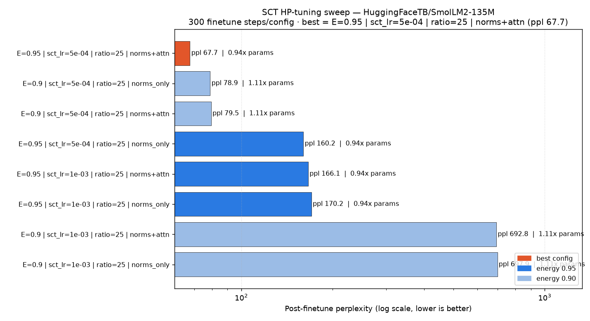

# Optimizing_and_weight_reducing_LLMS

Here I try to find ways to get better weight and KV cache optimization, starting off with finding the optimal frontier by combining SCT and TurboQuant.

## Sub-projects

- `SCT/` — Spectral Compact Training: replaces nn.Linear with U diag(s) V^T factors; gradients flow through spectral factors with Stiefel retraction.
- `turboquant/` — TurboQuant KV cache compression: random rotation + Lloyd-Max quantization for keys + group quantization for values.

## Theory track (laptop, no HPC)

- `theory/THEORETICAL_ANALYSIS.md` — analytic error models for SCT (low-rank **bias** ∝ `(1−η)`, Eckart–Young) and TurboQuant (unbiased **variance** ∝ `2^(−2b)`), combined into a rate–distortion objective `ΔL ≈ α(1−η)+β·2^(−2b)` whose budget-constrained optimum is "equal marginal loss per byte". Includes a tiny linear-attention + linear-MLP Gaussian toy to validate the models, an analysis roadmap, and grouped references.
- **Implemented & validated** (`theory/toy/`, `theory/models/`, see `theory/README.md`). One command — `conda activate ml_lab && python theory/run_experiments.py` (~1 min) — runs all Part B arms + the Part A solver and writes `theory/RESULTS.md`. Headline findings:
  - **A.1 (locally-quadratic loss) confirmed as an *equality*** — the toy loss is exactly quadratic in each weight matrix (cross-term ~1e-4, known-H readout check to 7e-8, Eckart–Young control exact). **But the scalar `α(1−η)` model is rejected** — ΔL is concave in `(1−η)` (linear R²=0.23 iso, −2.6 aniso); the exact model is the curvature-weighted quadratic, so the solver consumes the **measured distortion–rate curve**, not `α(1−η)`.
  - **A.2 (TurboQuant unbiased variance) confirmed** (bias²/var ~1e-5), but the effective exponent is **p≈1.83, not the asymptotic 2** (finite-rate Lloyd–Max) — the solver uses the measured `p`.
  - **A.3 additivity is regime-dependent**: additive in the operating region (median cross 5%) but **sub-additive coupling up to 46%** at aggressive joint compression — compressing weights first makes the KV cache cheaper to quantize (answers Part E q1). Truncation is also sub-additive *across layers*.
  - **Recovery-LoRA recovers ~84% of the bias (5.4× smaller local α)**; the solver then compresses weights harder (η\* 0.84→0.30) and reallocates bytes to KV.
  - **Solver:** at 50% of a balanced byte budget the optimum is *interior* (η\*=0.84, b\*=5.35) with KKT marginals equal to 3 sig figs. Regime finding: because measured SCT distortion is concave, tight budgets lean on **weights first** — contradicting §A.3's "TQ first" guess.

## Experiments

### Llama-3.1-8B Utility-vs-Compression Pareto Pipeline (A100)

**Files:** `run_pareto.py` + the `pipeline/` package · **Launcher:** `run.sh`

The scaled-up pipeline. Where the SmolLM2-135M experiment used perplexity only and
hid SCT's weight savings (hidden=576 < 2048), this runs **base Llama-3.1-8B**
(hidden=4096, where SCT actually compresses) and replaces "accuracy" with a real
**utility metric**.

**Utility metric** (`pipeline/utility.py`) — four benchmarks, each normalized to the
dense fp16 baseline (baseline ≈ 1.0), weighted (equal by default):

| Component | Benchmark | Direction |
|-----------|-----------|-----------|
| `s_ppl`   | wikitext-2 perplexity | lower better → `baseline_ppl/ppl` |
| `s_hs`    | HellaSwag acc_norm    | higher better |
| `s_mmlu`  | MMLU 4-way acc        | higher better |
| `s_tqa`   | TruthfulQA MC2        | higher better |

`U = Σ wᵢ·sᵢ ∈ [0,1]`. All four are run on the **same** compressed+quantized model,
forced through the TurboQuant cache (`use_cache=True`, eager attention) so KV
quantization genuinely affects the loglikelihood scores — a plain forward would run
`use_cache=False` and make quantization look free.

**Sweep axes:** SCT energy `{dense, 0.99, 0.97, 0.95, 0.90, 0.85}` × KV bits
`{fp16, 4×4, 3×4, 3×2, 2×2}` × recovery-LoRA `{off, on}` (toggle).

**Recovery-LoRA** (`pipeline/recovery.py`) — `peft` LoRA on the attention projections
(`q/k/v/o_proj`, which stay `nn.Linear` after SCT compresses only the MLP), trained on
an alpaca slice then `merge_and_unload`-ed → **zero extra storage**. The off/on toggle
exposes the recovery gain.

**Outputs** (`results_llama8b/`): `pareto_results.json`,
`pareto_utility_vs_compression.png` (frontier), and
`heatmap_energy_kv_{nolora,lora}.png` — the heatmap answers the two-way question (how
weight-compression energy shifts the tolerable quantization level, and vice-versa).

**Run:**
```bash
python -m venv .venv && source .venv/bin/activate
pip install -r requirements.txt
pip install -e SCT && pip install -e turboquant
cp .env.example .env          # paste HF_TOKEN (request gated Llama-3.1-8B access first)

./run.sh quick                # smoke test FIRST (tiny subsets, 1-2 points)
./run.sh full                 # full energy x KV x LoRA grid on the A100
```

Subset sizes, LoRA steps, and utility weights are all CLI flags
(`python run_pareto.py --help`).

**Performance note (fixed 2026-07-10):** quantized-KV eval points used to take
~1000s each even at `--quick`'s tiny subsets (256 ppl tokens / 20 examples),
which projected to multi-day for `./run.sh full`'s defaults. Root cause:
`make_cache_factory` rebuilt every layer's TurboQuant rotation/QJL matrices
(a CPU `torch.linalg.qr`) on *every forward call* instead of once — on this
node's 32-core CPU, torch's default 32-thread pool makes that tiny 128×128 QR
cost 155.7ms/call vs 0.43ms single-threaded (340×  thread-pool overhead, not
compute). Quantizers are now built once per layer and reused across an eval
point's forwards (`pipeline/tq_cache.py`, `pipeline/eval_tasks.py`) — same
seeds, numerically identical results, but `./run.sh full` now projects to
~16–20 hours instead of ~4–10 days.

#### Results — full 55-point grid (2026-07-11, 1×A100, GPU 1)

`{dense, E0.99, E0.97, E0.95, E0.90, E0.85} × {fp16, 4×4, 3×4, 3×2, 2×2} ×
{LoRA off, on}`, wall time **25728s (7.15h)** — well under the ~16–20h
projection. Results in `results_llama8b/pareto_results.json`; plots in
`pareto_utility_vs_compression.png` and `heatmap_energy_kv_{nolora,lora}.png`.

Pareto frontier (12 of 55 points, utility `U` vs. `compression_ratio` =
baseline_bytes / this_bytes, so `>1` means genuinely smaller than dense):

| Config | LoRA | U | ratio | ppl |
|---|---|---|---|---|
| dense / KV=fp16 | – | 1.000 | 1.000 | 5.47 |
| dense / KV=4×4 | – | 0.927 | 1.006 | 6.26 |
| dense / KV=3×4 | – | 0.748 | 1.006 | 10.19 |
| dense / KV=3×2 | – | 0.704 | 1.007 | 12.72 |
| E0.9 / KV=fp16 | on | 0.591 | 1.075 | 27.68 |
| E0.9 / KV=4×4 | on | 0.558 | 1.082 | 35.35 |
| E0.85 / KV=fp16 | on | 0.488 | 1.172 | 51.85 |
| E0.85 / KV=fp16 | off | 0.466 | 1.172 | 105233 |
| E0.85 / KV=4×4 | on | 0.465 | 1.180 | 70.26 |
| E0.85 / KV=4×4 | off | 0.462 | 1.180 | 84424 |
| E0.85 / KV=3×4 | off | 0.459 | 1.180 | 109255 |
| E0.85 / KV=2×2 | off | 0.455 | 1.181 | 54044 |

**Recovery-LoRA works as designed but doesn't close the gap.** At E0.85 (the
lowest energy tested, where SCT first shrinks the model ~1.18–1.2×), LoRA
drops perplexity from the catastrophic untrained-truncation floor
(84k–109k) to 51.85–70.26 — confirming the prediction logged after the
LoRA-off subset run. But **no point with real weight compression
(`ratio > 1`) reaches even 60% of dense utility** — best is E0.9+LoRA/fp16
at U=0.591, ratio=1.075. The only "free" win on this pipeline is 4-bit KV
quantization alone (dense/KV=4×4, U=0.927 for ~0.6% extra bytes saved from
KV, since weights dominate total size). SCT's weight compression, even with
LoRA recovery, is not yet a good trade at 8B scale — the byte savings (7–18%)
cost far more utility (25–41%) than 4-bit KV quantization costs for its
savings.

---

### Llama-3.1-70B scale-up + theory validation (1× A100 80GB)

The same pipeline, refactored to run **Llama-3.1-70B** on a single A100 80GB
(the shared node's GPU 0 is occupied → everything defaults to **GPU 1** via
`--gpus 1`, which pins `CUDA_VISIBLE_DEVICES` before torch loads).

**How 140GB of bf16 weights run on one 80GB GPU** (`pipeline/big_model.py`):

1. Load on **CPU** (`low_cpu_mem_usage` — needs ~150GB of host RAM).
2. Apply SCT while the model sits on CPU, with each layer's SVD computed **on
   the GPU** (`pipeline/sct_apply.py`, `--svd auto`). Full SVDs of 240 matrices
   of 8192×28672 would take days, so 70B-class layers use an **adaptive
   randomized SVD** (`torch.svd_lowrank`, sketch size doubled until the energy
   target is met; the energy denominator is the exact ‖W‖²_F). Verified against
   the full SVD: identical rank + retained energy on test spectra.
3. `dispatch_big()` — accelerate `infer_auto_device_map` + `dispatch_model`
   with `--max-gpu-mem 72` GiB. Compressed points usually fit wholly on-GPU;
   the **dense baseline stays partially CPU-offloaded** (PCIe-bound, slow, but
   bit-correct — expect it to dominate wall time).
4. Recovery-LoRA trains in place on the dispatched model (no `.to(cuda)`),
   batch 1 + gradient checkpointing (`--lora-batch 1 --lora-grad-checkpoint`).

**Run (on the HPC node):**
```bash
./run.sh dry70b     # integration smoke on GPU 1 — ALWAYS FIRST
./run.sh quick70b   # tiny end-to-end (datasets + 1 SCT point + TQ cache)
./run.sh full70b    # full energy × KV × LoRA grid, 70B-sized eval subsets
./run.sh theory     # theory-validation stage on the newest sweep results
# both GPUs free? append: --gpus 0,1
```
Outputs land in `results_llama-31-70b/`. (Accept the gated
`meta-llama/Llama-3.1-70B` license on HuggingFace first — separate from 8B.)

---

### Theory validation at LLM scale

**Files:** `run_theory_validation.py` + `pipeline/theory_validate.py`

The LLM-scale analogue of `theory/run_experiments.py`: consumes any sweep's
`pareto_results.json` and re-tests each toy claim on the real model, using
ΔL = ln(ppl/ppl_dense) as the distortion measure:

| # | Toy claim (theory/RESULTS.md) | LLM re-test |
|---|---|---|
| 1 | SCT distortion is **concave** in (1−η); α(1−η) rejected | linear vs power-law fit R², exponent p_w |
| 2 | TQ: ΔL ≈ β_p·2^(−p·b), **p≈1.83** | fit (β_p, p) from the KV-bits arm at dense weights |
| 3 | Errors **mostly additive**, sub-additive when joint | cross(η,b)/ΔL_joint median/max/sign |
| 4 | Recovery-LoRA recovers **~84%** of SCT bias, ~constant in η | per-η recovery fraction |
| 5 | Part A solver: interior (η\*, b\*) per budget | solver re-run on **measured** curves vs best measured point under the same budget |

The solver stage reuses `theory/models/rate_distortion.py` verbatim — only the
inputs change (measured weight-byte curve, measured KV byte slope, fitted
β_p/p, measured/post-LoRA distortion curves). Validated end-to-end on synthetic
sweeps with planted laws: recovers p_w, p, β_p, and the recovery fraction
exactly, and its predicted optima land on the measured-best grid cell.

Outputs (next to the input JSON): `theory_validation.md` (side-by-side
LLM-vs-toy tables), `theory_validation.png` (4-panel: SCT shape, TQ exponent,
additivity scatter, solver-vs-sweep overlay), `theory_validation.json`.

---

### SCT x TurboQuant Joint Pareto Frontier (SmolLM2-135M, CPU — earlier work)

**File:** `experiments/sct_tq_pareto.py`

Sweeps SCT energy thresholds (None=dense, 0.99, 0.95, 0.90, 0.80) x TurboQuant KV
configurations (fp16-full, k=4/v=4, k=3/v=4, k=3/v=2, k=2/v=2) on SmolLM2-135M.

Measures perplexity, weight bytes, compressed KV bytes, peak RSS, and tokens/sec
for each combination, then computes the Pareto frontier.

**Run (full sweep):**
```bash
# From sct_tq/ directory:
experiments/run.sh experiments/sct_tq_pareto.py --max-tokens 768
```

**Quick smoke test (2 energies x 2 TQ configs, ~30 seconds on CPU):**
```bash
experiments/run.sh experiments/sct_tq_pareto.py --quick --max-tokens 128
```

**With optional SCT finetune (to recover quality after truncation):**
```bash
experiments/run.sh experiments/sct_tq_pareto.py --max-tokens 512 --finetune-steps 200 --energies 0.95 0.90
```

**Outputs:**
- `experiments/sct_tq_pareto_results.json` — all config results
- `experiments/sct_tq_pareto.png` — scatter plot: perplexity vs total bytes, Pareto frontier highlighted

**Key findings (SmolLM2-135M, 128 tokens):**
- TurboQuant (k=3, v=4) gives 3.77x KV byte reduction (2949KB -> 783KB) at a perplexity cost of 3.6x (22.76 -> 81.82 on 128 tokens with full compression).
- SCT weight compression is negligible or negative at 135M scale (hidden_dim=576 < 2048 threshold). See CLAUDE.md for details.
- Without finetune, SCT severely degrades perplexity — use `--finetune-steps` for quality recovery.
- The Cache subclass approach (TurboQuantLayer subclassing DynamicLayer from transformers 5.x) works successfully.

**Environment:**
```bash
# Venv is at /scratch/DA24B039/sct_tq/.venv
# Python 3.13.12 from /opt/miniconda3/bin/python
# PyTorch 2.12.0+cpu, transformers 5.12.0
# run.sh sets LD_LIBRARY_PATH=/opt/miniconda3/lib (precautionary for CXXABI)
```

---

### SCT Per-Component LR Finetune (reusable function)

**File:** `experiments/sct_finetune.py`

Exposes `finetune_sct(model, tokenizer, *, sct_lr, lr_ratio, unfreeze, steps, ...)` — the
per-component learning rate recipe proven in `sct_per_component_lr.ipynb`. Two param groups:
- Group B (high lr = sct_lr): U, s, V factors of every SpectralLinear module
- Group A (low lr = sct_lr / lr_ratio): norm layers + (optionally) q/k/v/o_proj

Returns `{final_loss, final_ppl, steps, time_sec, sct_params, dense_params, loss_curve}`.

**Quick manual test:**
```bash
.venv/bin/python experiments/sct_finetune.py \
  --model HuggingFaceTB/SmolLM2-135M \
  --energy 0.95 --sct-lr 5e-4 --lr-ratio 25 --steps 120
```

---

### SCT HP-Tuning Harness

**File:** `experiments/sct_hp_tune.py`

Grid-searches (energy, sct_lr, lr_ratio, unfreeze) for the best per-component LR recipe.
For each config: loads fresh model, applies SCT at given energy, calls `finetune_sct()`,
evaluates held-out perplexity on wikitext-2. Prints table sorted by ppl (best first).
Saves all results + best recipe to `sct_hp_tune_{model_tag}.json`.

**Default grid (small, intended for 135M):**
```bash
.venv/bin/python experiments/sct_hp_tune.py \
  --energies 0.95 \
  --sct-lrs 1e-3 5e-4 1e-4 \
  --lr-ratios 25 10 \
  --unfreeze norms+attn norms_only \
  --steps 300 --max-eval-tokens 512
```

**Smoke validation (single config, ~3 min on 135M CPU):**
```bash
.venv/bin/python experiments/sct_hp_tune.py \
  --energies 0.95 --sct-lrs 5e-4 --lr-ratios 25 \
  --unfreeze norms+attn --steps 120 --max-eval-tokens 256
# Result: post-SCT ppl 6318 -> post-finetune ppl 144 (44x improvement, 120 steps)
```

**Probe mode (timing only — no full finetune):**
```bash
.venv/bin/python experiments/sct_hp_tune.py \
  --model HuggingFaceTB/SmolLM2-135M \
  --energies 0.95 --sct-lrs 5e-4 --lr-ratios 25 --unfreeze norms+attn \
  --probe
# 135M: 591 MB load, ~1.48s/step -> 300 steps in ~7.4 min
# Use with 1.7B to get step budget before committing to long run
```

**Outputs:**
- `experiments/sct_hp_tune_{model_tag}.json` — all grid results + best recipe

**Plot the results:**
```bash
experiments/run.sh experiments/plot_hp_tune.py
# -> experiments/sct_hp_tune_SmolLM2-135M.png
```

#### Results — SmolLM2-135M sweep (8 configs, 300 steps each)



| energy | sct_lr | unfreeze    | params | post-FT ppl |
|:------:|:------:|:------------|:------:|:-----------:|
| 0.95   | 5e-4   | norms+attn  | 0.94x  | **67.7**    |
| 0.90   | 5e-4   | norms_only  | 1.11x  | 78.9        |
| 0.90   | 5e-4   | norms+attn  | 1.11x  | 79.5        |
| 0.95   | 5e-4   | norms_only  | 0.94x  | 160.2       |
| 0.95   | 1e-3   | norms+attn  | 0.94x  | 166.1       |
| 0.95   | 1e-3   | norms_only  | 0.94x  | 170.2       |
| 0.90   | 1e-3   | norms+attn  | 1.11x  | 692.8       |
| 0.90   | 1e-3   | norms_only  | 1.11x  | 697.9       |

**Observations:**
- **Best recipe: energy 0.95, sct_lr 5e-4, lr_ratio 25, unfreeze norms+attn → ppl 67.7.**
  This is the only sub-70 config and beats the next best by ~15%.
- **sct_lr is the dominant knob.** Dropping sct_lr from 1e-3 to 5e-4 helps everywhere;
  at energy 0.90 it is the difference between recovery (≈79 ppl) and collapse (≈690 ppl).
  1e-3 is too aggressive for the spectral factors here.
- **Higher energy (0.95) needs the right LR.** With sct_lr 5e-4 it wins outright (67.7),
  but with 1e-3 it lands at ~166–170 — still far better than energy-0.90/1e-3's ~690s.
- **Unfreezing attention helps only at low LR / high energy.** norms+attn is best in the
  winning row, but at energy 0.90 it gives no real gain over norms_only, and pairing it
  with sct_lr 1e-3 produces the worst result.
- **Compression caveat persists at 135M.** energy 0.95 keeps params *below* dense (0.94x)
  while energy 0.90 actually *inflates* them to 1.11x — at hidden_dim=576 the spectral
  factors are large relative to the dense weights (see CLAUDE.md), so the best-quality
  config also happens to be the only compressive one here. Real weight savings need ≥1.7B.
- Even the best post-finetune ppl (67.7) is well above dense (1.81); 300 steps on 500
  samples is a recovery probe, not a full retrain. The recipe ranking is the takeaway.
